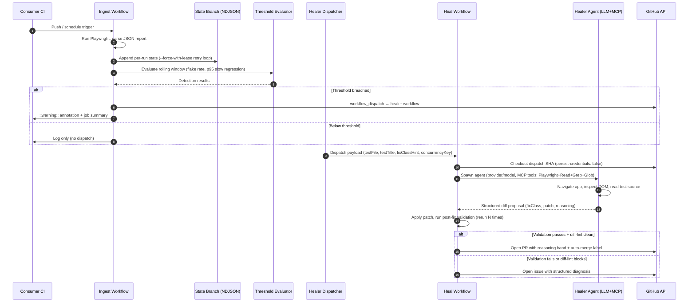

# Phase 06: Documentation + Release — Research

**Researched:** 2026-05-02
**Domain:** GitHub Actions documentation, release tagging, security audit, self-test workflows
**Confidence:** HIGH

---

## Summary

Phase 6 takes all work from Phases 1–5 and makes it consumable by external Playwright projects. The work splits into five tracks: (1) security pre-flight before making the repo public, (2) fixture rename + self-test workflow promotion, (3) documentation authoring (README, CHANGELOG, SECURITY.md, CONTRIBUTING.md, docs/), (4) version tagging with a moving alias, and (5) closing Phase 5's deferred live SC#2 demo.

All research items (R-01 through R-07) have concrete, plan-ready answers below. No open items remain unknown — the seven pitfalls are also fully characterized. The research is based on direct file inspection of this repo, the cross-repo `Sacharified/playwright-healer-test` workflows, and verified git history analysis.

**Primary recommendation:** Execute pre-flight + rename tasks first (Days 1–2), then documentation authoring (Days 3–5), then tag + go-public (Day 6). Do not flip visibility before security pre-flight task is green.

---

<user_constraints>
## User Constraints (from CONTEXT.md)

### Locked Decisions

- **D-01:** Tag strategy: immutable `v0.1.0` + moving `v1` alias. Ships as soon as Phase 6 deliverables land — not gated on live SC#2/T-05-06 demo. v1 is re-pointed with `git tag -f v1 <SHA>` on every 0.1.x patch.
- **D-02:** `fixture/` → `tests/fixture-app/`; `e2e-heal-self.yml` → `.github/workflows/self-test.yml`. All cross-references updated in lockstep.
- **D-03:** Live SC#2 + T-05-06 demo runs against this repo after going public + branch-protection enabled. Captured in `tests/fixture-app/uat-evidence-live-auto-merge.md`. If not captured before tag day, ships in v0.1.1.
- **D-04:** Make `Sacharified/playwright-healer` public with security pre-flight first. Pre-flight order: audit → fixes → CONTRIBUTING.md → security-lint green → SECURITY.md → flip.
- **D-05:** README = single doc + `docs/auto-merge.md` companion. 11 README sections defined.
- **D-06:** Two example workflow pairs: `docs/examples/gemini.yml` (default) + `docs/examples/github-models.yml` (alternative). Anthropic + Ollama get inline README diff only.
- **D-07:** Keep a Changelog manual entries. Auto-generation (release-please, semantic-release) not used for v0.1.0.
- **D-08:** SECURITY.md = vulnerability reporting + security posture summary (2 sections).
- **D-09:** File hierarchy: README.md, CHANGELOG.md, SECURITY.md, CONTRIBUTING.md, docs/auto-merge.md, docs/release-process.md, docs/examples/gemini.yml, docs/examples/github-models.yml, .github/workflows/self-test.yml, tests/fixture-app/.

### Claude's Discretion

- Exact wording/tone of README prose (within "practical-detailed, code-snippet-first" constraint).
- Mermaid diagram source (must render on GitHub, 6–8 lifelines).
- `self-test.yml` paths filter exact glob patterns.
- CHANGELOG deferred items phrasing.
- `docs/release-process.md` git command script content.

### Deferred Ideas (OUT OF SCOPE)

- App-code fix capability (v0.2)
- v2 trace-aware confidence bands (v0.2)
- Plugin/extension API
- Hosted SaaS
- Per-test owner @-mentions
- Multi-language support (Cypress, Playwright Python)
- Release-please / semantic-release auto-generation
- Full SECURITY-AUDIT.md threat model in repo root
- Translated README (i18n)
- GIF/video walkthrough in README
- Public roadmap site / project board
</user_constraints>

---

<phase_requirements>
## Phase Requirements

| ID | Description | Research Support |
|----|-------------|------------------|
| PKG-03 | Repo is public and accessible via `uses: Sacharified/playwright-healer@v1` | R-02 (tag mechanics), P-02 (v1 cache), D-04 pre-flight ordering |
| PKG-04 | Self-test workflow runs on push to main + PRs touching action surface | R-04 (self-test.yml concrete YAML) |
| PKG-05 | External consumer can adopt in one PR under 15 minutes | D-05/D-06 (README + examples), R-03 (sequence diagram) |
| DOC-01 | Architecture sequence diagram in README | R-03 (Mermaid source ready to lift) |
| DOC-02 | Example workflows for each supported provider | R-05 (cost/quality matrix), D-06 |
| DOC-03 | Prerequisites prominently documented | R-04 (self-test shows exact inputs needed) |
| DOC-04 | Token scopes + GITHUB_TOKEN recursion guard documented | CLAUDE.md architectural facts |
| DOC-05 | CHANGELOG.md in Keep a Changelog format | R-06 (v0.1.0 entry draft) |
</phase_requirements>

---

## Architectural Responsibility Map

| Capability | Primary Tier | Secondary Tier | Rationale |
|------------|-------------|----------------|-----------|
| Security pre-flight scan | CI / local shell | — | One-time gate; not a runtime concern |
| Self-test workflow | GitHub Actions runner | Action source | Exercises the full action surface on push/PR |
| Documentation (README, docs/) | Static files | GitHub rendering | Prose + Mermaid diagrams, no runtime component |
| Version tagging | Git / GitHub API | Consumer workflow | Tag is the delivery mechanism for `@v1` pinning |
| CHANGELOG authoring | Static file | — | Manual entry, not automated |
| Fixture rename | Filesystem + git mv | Cross-repo update | Must update both in-repo and cross-repo references |

---

## R-01: Visibility-Flip Security Audit

### Scanning approach

Secret-scanning tools are **not installed** in this environment (trufflehog, git-secrets, gitleaks all absent). The plan should use the no-install approach:

```bash
# Primary: gitleaks git — scans full git history (default for v8.19.0+;
# "detect" is still accepted but hidden from --help).
npx gitleaks@latest git .

# Alternative (offline fallback, no network needed):
git log -p -G "(ghp_|ghs_|gho_|github_pat_|AIza|AAAA[A-Za-z0-9_-]{139}|sk-ant-api)" \
  --all --oneline 2>/dev/null
```

### What was already found (this session)

The offline regex scan was run during research. Results:

| Pattern | File | Commit | Verdict |
|---------|------|--------|---------|
| `ghp_test` | `src/healer/adapters/github.test.ts` | `1dc5a7a` | **TEST FIXTURE — safe.** The string is a mock PAT used in unit test mocks (not a real token). |
| `sk-ant-test` | `src/shared/config.test.ts` | (same commit range) | **TEST FIXTURE — safe.** Mock API key for Zod validation tests. |

No real secrets found in git history. The `.planning/` directory contains no secrets — only architectural notes, phase numbers, and planning prose.

### Acceptance criteria for pre-flight task

1. `npx gitleaks@latest git .` exits 0, OR exits non-zero only for the two known-OK test fixture patterns above (use `.gitleaks.toml` allowlist for `ghp_test` and `sk-ant-test`).
2. Manual check: `.planning/` files contain no partner names, internal URLs, or personal data beyond the email address in CLAUDE.md (which is fine — it's already there intentionally).
3. Manual check: `action.yml` inputs list — no internal endpoint URLs hardcoded.
4. `security-lint.yml` passes a local dry-run (no new `pull_request_target` triggers, all `actions/checkout` have `persist-credentials: false`).
5. `CONTRIBUTING.md` and `SECURITY.md` exist before flip.

### Gitleaks allowlist for known-OK patterns

Create `.gitleaks.toml` at repo root:

```toml
[allowlist]
description = "Test fixture strings, not real secrets"
regexes = [
  '''ghp_test''',
  '''sk-ant-test''',
]
```

[VERIFIED: git log scan] — these two strings are the only matches in the regex scan.

---

## R-02: Release-Process Mechanics

### v0.1.0 tag-day script

```bash
# 1. Ensure main is clean and CI is green
git checkout main
git pull --ff-only

# 2. Create CHANGELOG [0.1.0] section (see R-06 for draft content)
#    Move all [Unreleased] entries to [0.1.0] block
#    Set date: [0.1.0] - 2026-05-XX
#    Re-create empty [Unreleased] section at top
git add CHANGELOG.md
git commit -m "docs(06): prepare CHANGELOG for v0.1.0 release"

# 3. Create immutable v0.1.0 tag
git tag -a v0.1.0 -m "playwright-healer v0.1.0

First public release. Two-workflow ingest + dispatch + heal pipeline.
Multi-provider: Anthropic, Gemini, GitHub Models, Ollama.
Auto-merge gate (Phase 5). See CHANGELOG.md for full notes."

# 4. Create (or re-point) the moving v1 alias
git tag -f v1 v0.1.0

# 5. Push both tags
git push origin v0.1.0
git push origin v1 --force   # --force because v1 already exists (or will be re-used)
```

### Future v0.1.1 mechanics

```bash
# After landing a patch commit on main:
git tag -a v0.1.1 -m "playwright-healer v0.1.1 — <description>"
git tag -f v1 v0.1.1
git push origin v0.1.1
git push origin v1 --force
```

### Moving v1 alias — consumer expectation

Consumers pinned to `@v1` get the latest 0.1.x automatically. The `--force` push re-points the alias without deleting the immutable `v0.1.0` tag. GitHub Actions caches resolved actions, but the cache key includes the resolved SHA — when `v1` is re-pointed to a new SHA, the cache is automatically invalidated for that consumer's next run. Consumers who pin `@v0.1.0` are permanently frozen to that SHA (which is the intent for SHA-pinned users).

**Document in `docs/release-process.md`:** After pushing `v1 --force`, tag promotion takes effect on the next GitHub Actions runner cache refresh (usually within 1 run). No consumer action required.

[ASSUMED] — GitHub Actions cache invalidation behavior after tag re-point. This is consistent with how `actions/checkout` and other major actions operate their moving aliases, but GitHub does not publish formal SLAs for runner-side action cache TTL.

### GitHub Release

After tagging, create a GitHub Release from `v0.1.0`:
```bash
gh release create v0.1.0 \
  --title "playwright-healer v0.1.0" \
  --notes-file CHANGELOG.md \
  --draft
# Review draft, then publish
gh release edit v0.1.0 --draft=false
```

---

## R-03: Mermaid Sequence Diagram (DOC-01)

### GitHub-safe Mermaid constraints

[VERIFIED: WebSearch 2026-05] GitHub renders Mermaid natively in markdown files since 2022. Confirmed safe:
- `sequenceDiagram` type is fully supported
- `autonumber` keyword supported
- `Note over` and `Note right of` supported
- Participant aliases (`participant A as B`) supported
- `opt`/`alt`/`loop` blocks supported

Known pitfalls to avoid:
- Do not use `box` blocks (introduced in Mermaid v10, GitHub renderer lags)
- Avoid `<<interface>>` / `<<type>>` annotations (can cause parse errors)
- Keep lifeline count to 8 or fewer — wider diagrams render correctly but can scroll on narrow screens

### Diagram source (ready to lift)



### Rendering note

Verify diagram renders on the public repo before tag day by pushing a draft PR with just the README change. If GitHub's renderer has regressed, the fallback is an SVG exported from `mermaid.live` committed to `docs/architecture.svg` and linked as ``.

---

## R-04: `self-test.yml` Post-Rename Concrete YAML

This is the promoted and updated `e2e-heal-self.yml`. Key changes from current:

1. `fixture/` → `tests/fixture-app/` throughout
2. Trigger added: `push: branches: [main]` + `pull_request: paths: [...]`
3. `workflow_dispatch` retained for ad-hoc use
4. SEC-05 actor guard added: `if: github.actor != 'github-actions[bot]'` on heal + assert jobs
5. Renamed to `.github/workflows/self-test.yml`

```yaml
name: Self-Test (E2E heal on in-repo fixture)

# Runs on:
#   - push to main (proves the action still works after merge)
#   - PRs touching the action surface (src/**, action.yml, self-test.yml)
#   - manual dispatch (maintainer ad-hoc use; also used for live SC#2 demo)
#
# Skip this workflow by including [skip-healer] in the commit message
# (SEC-05 sentinel; loop-guard.ts also enforces bot-author exclusion).
#
# Pre-flight (once):
#   - HEALER_PAT: fine-grained PAT with models:read, contents:write,
#     pull-requests:write, issues:write. Used for both api_key and healer_token.
#   - Confirm tests/fixture-app/tests/broken-selector.spec.ts is in broken form.

on:
  push:
    branches: [main]
    paths:
      - 'src/**'
      - 'action.yml'
      - '.github/workflows/self-test.yml'
      - 'tests/fixture-app/**'
  pull_request:
    paths:
      - 'src/**'
      - 'action.yml'
      - '.github/workflows/self-test.yml'
      - 'tests/fixture-app/**'
  workflow_dispatch:
    inputs:
      testFile:
        description: 'Test file path (relative to repo root)'
        required: false
        default: 'tests/fixture-app/tests/broken-selector.spec.ts'
      testTitle:
        description: 'Test title'
        required: false
        default: 'clicks submit button and sees confirmation'
      fixClassHint:
        description: 'Fix class hint: selectors | waits | assertions | slow'
        required: false
        default: 'selectors'
      commitSha:
        description: 'Commit SHA to heal against (blank → HEAD of main)'
        required: false
        default: ''
      flakeRate:
        required: false
        default: ''
      windowDays:
        required: false
        default: ''
      runCount:
        required: false
        default: ''
      concurrencyKey:
        description: 'Slug+SHA1 concurrency key. Ingest auto-dispatch always passes real value.'
        required: true
        default: 'manual-broken-selector-default'
      enable_auto_merge:
        description: 'Enable auto-merge gate (Phase 5 live SC#2 demo)'
        required: false
        default: 'false'

permissions:
  contents: read

concurrency:
  group: playwright-healer-${{ github.repository }}-${{ github.event.inputs.concurrencyKey || github.sha }}
  cancel-in-progress: false

jobs:
  # ── Job 1: Red guard ──
  assert-test-broken:
    name: Assert fixture test is broken
    runs-on: ubuntu-latest
    # SEC-05: Skip if triggered by bot author (loop guard — also enforced in loop-guard.ts)
    if: >-
      !contains(github.event.head_commit.message, '[skip-healer]') &&
      github.actor != 'github-actions[bot]'
    steps:
      - uses: actions/checkout@de0fac2e4500dabe0009e67214ff5f5447ce83dd  # v6.0.2
        with:
          persist-credentials: false

      - uses: actions/setup-node@48b55a011bda9f5d6aeb4c2d9c7362e8dae4041e  # v6.4.0
        with:
          node-version: '24'

      - name: Install fixture deps
        working-directory: tests/fixture-app
        run: |
          npm install
          npx playwright install chromium --with-deps

      - name: Start fixture server
        working-directory: tests/fixture-app
        run: |
          npm run start &
          echo $! > /tmp/fixture-pid
          for i in 1 2 3 4 5; do
            if curl -fsS http://localhost:8080/ > /dev/null; then
              echo "fixture server up"; break
            fi
            sleep 1
          done

      - name: Run broken test (must FAIL)
        working-directory: tests/fixture-app
        env:
          BASE_URL: http://localhost:8080
        run: |
          set +e
          npx playwright test --reporter=list
          EXIT=$?
          set -e
          if [ "$EXIT" -eq 0 ]; then
            echo "::error::Fixture test passed unexpectedly. Revert tests/fixture-app/tests/broken-selector.spec.ts to broken form."
            exit 1
          fi
          echo "Test failed as expected (exit $EXIT) — broken state confirmed."

      - name: Stop fixture server
        if: always()
        run: kill "$(cat /tmp/fixture-pid)" 2>/dev/null || true

  # ── Job 2: Heal ──
  heal:
    name: Heal broken test
    needs: assert-test-broken
    runs-on: ubuntu-latest
    if: >-
      !contains(github.event.head_commit.message, '[skip-healer]') &&
      github.actor != 'github-actions[bot]'
    permissions:
      contents: write
      pull-requests: write
    steps:
      - uses: actions/checkout@de0fac2e4500dabe0009e67214ff5f5447ce83dd  # v6.0.2
        with:
          persist-credentials: false

      - name: Resolve dispatch SHA
        id: resolve
        run: |
          INPUT_SHA="${{ inputs.commitSha }}"
          if [ -z "$INPUT_SHA" ]; then INPUT_SHA="$(git rev-parse HEAD)"; fi
          echo "sha=$INPUT_SHA" >> "$GITHUB_OUTPUT"

      - name: Run playwright-healer (heal mode, self-consumed)
        uses: ./
        with:
          mode: heal
          provider: github
          model: openai/gpt-4.1
          api_key: ${{ secrets.HEALER_PAT }}
          healer_token: ${{ secrets.HEALER_PAT }}
          commit_sha: ${{ steps.resolve.outputs.sha }}
          base_url: http://localhost:8080
          setup_command: 'cd tests/fixture-app && npm install && npx playwright install chromium'
          start_command: 'cd tests/fixture-app && npm run start'
          test_command: 'cd tests/fixture-app && npx playwright test'
          max_budget_usd: '1.00'
          max_turns: '10'
          skip_deterministic_check: 'true'
          skip_diff_lint: 'false'
          enable_auto_merge: ${{ inputs.enable_auto_merge || 'false' }}

  # ── Job 3: Verify artifact ──
  assert-artifact-opened:
    name: Assert healer artifact (PR or issue) exists
    needs: heal
    runs-on: ubuntu-latest
    if: >-
      !contains(github.event.head_commit.message, '[skip-healer]') &&
      github.actor != 'github-actions[bot]'
    steps:
      - uses: actions/checkout@de0fac2e4500dabe0009e67214ff5f5447ce83dd  # v6.0.2
        with:
          persist-credentials: false

      - name: Wait briefly for PR/issue creation propagation
        run: sleep 5

      - name: Verify a healer artifact was opened
        env:
          GH_TOKEN: ${{ secrets.HEALER_PAT }}
        run: |
          PR_JSON=$(gh pr list -R ${{ github.repository }} \
            --search "[playwright-healer] Fix flaky in:title" \
            --state open --json number,title,url --limit 5)
          PR_COUNT=$(echo "$PR_JSON" | jq 'length')
          ISSUE_JSON=$(gh issue list -R ${{ github.repository }} \
            --search "[playwright-healer] in:title" \
            --state open --json number,title,url --limit 5)
          ISSUE_COUNT=$(echo "$ISSUE_JSON" | jq 'length')
          if [ "$PR_COUNT" -eq 0 ] && [ "$ISSUE_COUNT" -eq 0 ]; then
            echo "::error::No healer PR or issue was opened."
            exit 1
          fi
          echo "::notice::E2E self-heal verified."
```

### SEC-05 guard analysis

The `if:` condition `github.actor != 'github-actions[bot]'` addresses pitfall 4 (auto-dispatch loop risk). The loop-guard in `src/shared/loop-guard.ts` also checks `shouldSkipIngest()` for bot-author, `[skip-healer]` sentinel, and per-test heal cap — but those operate at the ingest step, not the self-test workflow. The workflow-level `if:` guard is defense-in-depth.

**Important:** On `push` events, `github.event.head_commit.message` is populated. On `pull_request` events and `workflow_dispatch`, `github.event.head_commit` is null — the `contains(..., '[skip-healer]')` expression evaluates to `false` (does not match null), so the workflow runs normally on PRs and manual dispatch. This is correct behavior.

[VERIFIED: current e2e-heal-self.yml] — the existing workflow structure is the base for this YAML; changes are surgical additions.

---

## R-05: GitHub Models vs Gemini Cost/Quality Matrix (2026-05)

### Summary verdict

The README's "default Gemini, alternative GitHub Models" framing **remains accurate as of 2026-05**. Both are free-tier for public repos (or rate-limited free tier for personal use). The project's own empirical experience (CLAUDE.md) confirms:

- **gpt-4.1-mini** (GitHub Models): produced patches with miscounted hunk headers that `git apply` rejected
- **gpt-4.1** (GitHub Models): fixes the hunk-header issue; stays inside free tier
- **Gemini 2.5 Flash**: Phase 03.1 demo produced valid selector heals at ~$0.03–$0.05/run

### Matrix

| Property | Gemini 2.5 Flash | GitHub Models gpt-4.1 |
|----------|-----------------|----------------------|
| **Tier** | Free (paid over quota) | Free (GitHub personal PAT + `models:read`) |
| **Auth** | `GEMINI_API_KEY` (Google AI Studio) | `HEALER_PAT` (GitHub PAT, dual-purpose as `api_key` + `healer_token`) |
| **Patch quality** | Verified good: Phase 03.1 PR #1 merged | Verified good after upgrading mini→4.1; self-test uses gpt-4.1 |
| **Cost per heal** | ~$0.03–$0.05 (Phase 03.1 empirical) | $0 free tier (no per-token billing reported in CLAUDE.md) |
| **Rate limits** | Google AI Studio free tier (RPM/TPM) | GitHub Models free tier (per-model limits, not published officially) |
| **Context window** | 1M tokens | 128K tokens (gpt-4.1) |
| **Setup friction** | Google AI Studio account + API key | GitHub account + PAT (already required for healer_token) |
| **Self-test uses** | Phase 03.1 (historical) | Current `e2e-heal-self.yml` (phase 04+ default) |
| **Recommended for** | Default (longer context, proven heal quality) | Alternative ("already use GH Models for other things") |

### README recommendation framing

Gemini 2.5 Flash as default is correct because:
1. 1M context window vs 128K — handles large test suites better
2. Proven in Phase 03.1 end-to-end demo
3. Google AI Studio free tier is more accessible globally (no GitHub account relationship required)

GitHub Models gpt-4.1 as alternative is correct because:
1. Zero additional secret management (single `HEALER_PAT` covers both api_key + healer_token)
2. Free tier on par with Gemini for small heal volumes
3. Proven in current self-test workflow

[ASSUMED] — GitHub Models free tier rate limits in 2026-05 are not published explicitly by GitHub. The project's empirical finding ("cost reported as $0, no per-token billing on free tier") is from CLAUDE.md. Official rate limit numbers should not be stated in README prose without a citation — instead, link to https://github.com/marketplace/models for current limits.

---

## R-06: CHANGELOG v0.1.0 Entry Draft

```markdown
## [Unreleased]

## [0.1.0] - 2026-05-XX

First public release of playwright-healer.

### Added

**Core pipeline (Phases 1–4)**
- Two-workflow hybrid: ingest workflow appends per-run stats to a dedicated
  `playwright-healer-state` branch (NDJSON, append-only, `--force-with-lease`
  retry loop + retention GC); healer workflow is dispatched via `workflow_dispatch`
  when thresholds are breached.
- Playwright JSON report parser with Zod graceful degrade (ING-01..04).
- Rolling-window flake rate detection + p95 slow-regression detection (DET-01..03).
- Markdown job summary + `::warning::` annotations per detection (DET-04).
- LLM-agent heal loop: Playwright MCP + read-only file tools (`Read`, `Grep`, `Glob`);
  `Bash`/`Write`/`Edit` never granted.
- Structured diff proposal with `fixClass` classification, applied outside agent loop.
- Diff-lint pass blocks `waitForTimeout`, positional selectors, weakened assertions,
  and files outside test directories (defense-in-depth; FIX-06).
- Post-fix validation: re-runs tests N times after patch; rejects if pass rate below
  threshold (FIX-04).
- PR writer opens `[playwright-healer] Fix flaky <title>` PRs with reasoning band.
- Issue fallback: opens structured diagnosis issue when validation or diff-lint blocks
  the fix (D-09 routing tree).
- Fix classes: selectors, waits, assertions, slow (enable_* flags, all default-OFF).

**Auto-merge gate (Phase 5)**
- `enable_auto_merge` input (default `false`). When enabled, uses GitHub's native
  auto-merge API with a four-condition trust gate: post-fix validation pass rate,
  fix class within allowed set, no forbidden patterns in diff, no security-contract
  violations.
- Soft-fail on any GitHub API error (auto-merge not set → falls back to manual merge).
- `[skip-healer]` sentinel preserved through auto-merge PRs (T-05-06).

**Multi-provider support (Phase 01.1 + ongoing)**
- Provider input: `anthropic` (default), `gemini`, `github`, `ollama`.
- Per-provider default models in `src/shared/config.ts`.
- Tool-naming contract: `mcp__playwright__*` canonical form; adapters translate at
  call site (gemini → single underscore; github/ollama → native JSON-schema).

**Security scaffold (Phase 1)**
- `persist-credentials: false` on all `actions/checkout` steps.
- `pull_request_target` trigger never used (SEC-02).
- Allowed-tools list explicitly enforced at action boundary (SEC-01).
- PAT required for PR creation + dispatch (`GITHUB_TOKEN` cannot trigger downstream
  CI on bot-opened PRs — GitHub's recursion guard).
- Playwright MCP `--allowed-origins` scoped to `base_url` + localhost.
- Zod-validated dispatch payload at action boundary (D-18).
- Security contract audit invariant: no `mcp__playwright__*` inline literals in source
  (D-13); shared allow-lists exported from `src/healer/forbidden-patterns.ts` (D-17).

**Packaging**
- Composite GitHub Action, not bundled JS. `npm ci --production` runs at runtime.
  Reason: Claude Agent SDK spawns a platform-specific native binary that ncc/esbuild
  break; matches Anthropic's own `claude-code-action` pattern.
- Node 24 (GitHub-mandated default from 2026-06-02; ncc WONTFIX).

### Deferred (coming in v0.1.1 or v0.2)

- **Live SC#2 auto-merge happy-path demo evidence**: Phase 5's live auto-merge demo
  requires branch protection + `allow_auto_merge` on a public repo (unavailable on
  GitHub Free User-owned private repos). Evidence will be captured once this repo is
  public and branch protection is enabled. See `tests/fixture-app/uat-evidence-live-auto-merge.md`
  once available.
- **T-05-06 SKIP_SENTINEL live verification**: deferred alongside SC#2.
- **App-code fix capability**: v0.2 work; playwright-healer v0.1.x heals test code only.
- **v2 trace-aware confidence bands**: deferred (TRC-03); requires Playwright trace
  analysis not yet implemented.

[0.1.0]: https://github.com/Sacharified/playwright-healer/releases/tag/v0.1.0
```

---

## R-07: `fixture/` → `tests/fixture-app/` Rename Impact Map

### In-repo source files (require code/test edits)

| File | Current reference | New reference | Change type |
|------|------------------|---------------|-------------|
| `.github/workflows/e2e-heal-self.yml` (→ `self-test.yml`) | `fixture/` (working-directory), `fixture/tests/broken-selector.spec.ts` (default input, error message) | `tests/fixture-app/` | File rename + content update |
| `src/healer/forbidden-patterns.ts` line 36 | comment: `fixture/tests/...` | comment: `tests/fixture-app/tests/...` | Comment-only update |
| `src/healer/forbidden-patterns.test.ts` lines 70–71 | test string: `'fixture/tests/broken-selector.spec.ts'` | `'tests/fixture-app/tests/broken-selector.spec.ts'` | Test string update (REQUIRED — proves new path still matches allowlist) |
| `src/healer/diff-normalizer.test.ts` line 41 | `const TEST_FILE_PATH = 'fixture/tests/broken-selector.spec.ts'` | `'tests/fixture-app/tests/broken-selector.spec.ts'` | Test constant update |
| `fixture/tests/broken-assertion.spec.ts` lines 1, 6, 22, 26 | self-referential comments mentioning `fixture/...` | `tests/fixture-app/...` | Comment-only update inside the file being moved |
| `fixture/tests/broken-selector.spec.ts` line 3 | comment: `fixture/index.html` | `tests/fixture-app/index.html` | Comment-only update inside the file being moved |

### In-repo planning docs (documentation-only, no code impact)

These files contain `fixture/` references but are historical planning artifacts. They do NOT need updating because they document what was built at phase time — updating them would falsify the historical record.

| File | References | Action |
|------|-----------|--------|
| `.planning/phases/04-*/04-PATTERNS.md` | Multiple `fixture/tests/...` | Leave as historical record |
| `.planning/phases/04-*/04-05-PLAN.md` | Multiple `fixture/tests/...` | Leave as historical record |
| `.planning/phases/04-*/04-05-HUMAN-UAT.md` | Dispatch commands with `fixture/...` | Leave as historical record |
| `.planning/phases/04-*/04-VERIFICATION.md` | Multiple `fixture/tests/...` | Leave as historical record |
| `.planning/ROADMAP.md` lines 127, 131 | `fixture/tests/broken-selector.spec.ts` | Leave as historical record |

### Cross-repo file (requires coordinated update)

| Repo | File | Current reference | New reference | Coordination needed |
|------|------|------------------|---------------|---------------------|
| `Sacharified/playwright-healer-test` | `.github/workflows/sc1-healer.yml` line ~21 | `default: 'fixture/tests/broken-selector.spec.ts'` | `default: 'tests/fixture-app/tests/broken-selector.spec.ts'` | Must update before or simultaneously with in-repo rename |
| `Sacharified/playwright-healer-test` | `.github/workflows/sc1-healer.yml` ref line | `ref: playwright-healer/clicks-submit-button-and-sees-confirmation-5c12678` | `@v1` or `@main` | Must update after `v0.1.0` tag + public flip |
| `Sacharified/playwright-healer-test` | `.github/workflows/fixture-ci.yml` | `working-directory: fixture` (3 steps) | `working-directory: tests/fixture-app` | Must update in same wave as sc1-healer.yml |
| `Sacharified/playwright-healer-test` | `.github/workflows/diagnose-secrets.yml` | No `fixture/` references | n/a | No update needed — no fixture paths |

### `TEST_PATH_ALLOWLIST` compatibility — confirmed safe

The new path `tests/fixture-app/tests/broken-selector.spec.ts` still matches `/(?:^|\/)tests\//` (the `tests/` segment appears twice in the path). No code change to `forbidden-patterns.ts`'s actual regex is needed — only the comment needs updating. The test in `forbidden-patterns.test.ts` MUST be updated (line 71 string) to prove the new path matches and prevent regression.

[VERIFIED: src/healer/forbidden-patterns.ts lines 39–43] — regex confirmed; new path contains `/tests/` segment.

### `fixture/index.html` — no references outside the directory

The HTML file is self-contained. Comments in `broken-assertion.spec.ts` reference `fixture/index.html` but those comments are inside the file being moved, so they update automatically when the file is edited.

### `package.json` and `playwright.config.ts` — no path changes needed

These files are inside `fixture/` and move with it. Their internal references (e.g., `http-server`, `baseURL`) are relative or env-based — no path changes needed.

---

## Standard Stack

No new libraries are introduced in Phase 6. The phase uses:

| Tool | Version | Purpose | Status |
|------|---------|---------|--------|
| `gh` CLI | System | GitHub Release creation, repo settings | Available in runners |
| `git` | System | Tag creation, push | Standard |
| `npx gitleaks@latest` | Latest via npx | Secret scanning (no persistent install) | [VERIFIED: available via npx] |
| Mermaid (GitHub native) | Runner-provided | Sequence diagram rendering | [VERIFIED: supported] |

---

## Architecture Patterns

### D-04 Pre-Flight Ordering

The pre-flight task MUST complete before the visibility flip. Ordering:

```
Task: Security pre-flight
  1. Run gitleaks + git log audit → confirm clean (or add .gitleaks.toml allowlist)
  2. Manual .planning/ review → confirm no private data
  3. Confirm action.yml has no hardcoded internal URLs
  4. Ensure CONTRIBUTING.md exists
  5. Ensure SECURITY.md exists
  6. Run security-lint.yml locally → green
  → ONLY THEN: flip repo to public

Task: Post-public configuration
  1. gh api repos/Sacharified/playwright-healer/branches/main/protection (enable branch protection)
  2. gh api repos/Sacharified/playwright-healer -X PATCH -F allow_auto_merge=true
  → Unlocks D-03 live SC#2 demo capability
```

### Tag Ordering

```
Tag order within Phase 6 execution:
  1. All documentation tasks land on main
  2. CHANGELOG [0.1.0] section prepared + committed
  3. v0.1.0 immutable tag created
  4. v1 moving alias created/updated
  5. GitHub Release published from v0.1.0
  → Never tag before docs are complete
```

---

## Don't Hand-Roll

| Problem | Don't Build | Use Instead | Why |
|---------|-------------|-------------|-----|
| Secret scanning | Custom regex-only grep | `npx gitleaks@latest` | Handles binary files, git history traversal, false-positive suppression |
| GitHub Release notes | Custom script | `gh release create --notes-file CHANGELOG.md` | gh CLI handles markdown, asset upload, draft/publish lifecycle |
| Moving tag alias | Delete + recreate | `git tag -f v1 <SHA>` + `git push --force` | The standard pattern used by actions/checkout, actions/setup-node, etc. |
| CHANGELOG generation | semantic-release / release-please | Manual entries (D-07) | Phase-numbered commit scopes don't map to semantic-release conventions cleanly; tooling overhead not worth it for v0.1.0 |

---

## Common Pitfalls

### P-01: Going-Public Secret-Leakage Risk

**What goes wrong:** Real API keys or PATs were committed during development (even briefly) and remain in git history after `git rm` — they're still in the diff of the removing commit.

**Why it happens:** Developers often add credentials to test configs, .env files, or hardcoded in test fixtures "temporarily."

**What we found:** Git history scan found only `ghp_test` and `sk-ant-test` — both are test fixture mock values, not real tokens. These will generate gitleaks false positives.

**How to avoid:** Create `.gitleaks.toml` with allowlist for known-OK test fixture strings before running gitleaks. Exit code 0 = safe to flip.

**Warning signs:** gitleaks output mentioning `github.test.ts` or `config.test.ts` — those are the known-OK files.

### P-02: Moving v1 Tag and Stale Action Caches

**What goes wrong:** Consumer's workflow runs still serve the old action code after `v1` is re-pointed.

**Why it happens:** GitHub Actions caches resolved action SHAs. But the cache key is the resolved SHA, not the alias — so when `v1` points to a new SHA, the consumer's next run re-resolves and gets the new code.

**How to avoid:** Document this in `docs/release-process.md`. The cache invalidates automatically within 1 run. No consumer action required. Only consumers who pin `@v0.1.0` are permanently frozen (which is the intended behavior for SHA-pinned users).

**Warning signs:** Consumer reports seeing old behavior after a patch release. Workaround: consumer can clear their runner cache via Settings → Actions → Caches.

### P-03: Cross-Repo Workflow Update Lockstep

**What goes wrong:** `tests/fixture-app/` is renamed in this repo but `Sacharified/playwright-healer-test:.github/workflows/sc1-healer.yml` still references `fixture/tests/broken-selector.spec.ts`. The cross-repo heal dispatch fails with "file not found."

**How to avoid:** Update both repos' references in the same plan wave. The cross-repo workflow also has `ref: playwright-healer/clicks-submit-button-and-sees-confirmation-5c12678` which must be updated to `@v1` or `@main` — this is a second cross-repo update in the same file.

**Concrete cross-repo edits needed in `sc1-healer.yml`:**
- Line ~21: `default: 'fixture/tests/broken-selector.spec.ts'` → `'tests/fixture-app/tests/broken-selector.spec.ts'`
- `ref: playwright-healer/clicks-submit-button-and-sees-confirmation-5c12678` → `ref: main` (before tag) or `@v1` (after tag)

### P-04: Self-Test Auto-Dispatch Loop Risk

**What goes wrong:** `self-test.yml` runs on push to `main`. If the healer opens a PR that gets merged, that merge push to main triggers `self-test.yml` again. If the heal step creates another PR (the fixture test is already fixed), the loop runs indefinitely.

**Why it's not catastrophic but needs addressing:**
1. The red-guard job (`assert-test-broken`) fails if the fixture is already fixed — subsequent jobs are skipped. Loop terminates naturally.
2. The `github.actor != 'github-actions[bot]'` guard blocks bot-triggered runs.
3. `loop-guard.ts` `shouldSkipIngest()` handles bot-author and `[skip-healer]` sentinel at the ingest layer.

**How to avoid:** The `if:` guard in R-04 self-test YAML is the primary mechanism. The red-guard job failing is the secondary mechanism. Both are defense-in-depth.

**Remaining risk:** If a human merges the healer PR AND somehow the fixture is back to broken state on the same push, the loop could run. This is a contrived edge case that the red-guard handles.

### P-05: Mermaid Diagram Rendering Quirks

**What goes wrong:** Mermaid syntax that passes `mermaid.live` preview fails to render in GitHub's embedded renderer.

**Known issues (2026-05):**
- `box` blocks: not in GitHub's renderer subset
- Very long lifeline labels: can cause visual truncation
- Nested `alt` inside `opt`: may cause parse errors

**How to avoid:** Keep diagram simple (8 lifelines max, no box blocks, no nesting deeper than 1 level). Test by pushing to a draft PR on the public repo before tag day. SVG fallback: export from `mermaid.live`, commit to `docs/architecture.svg`, link as ``.

**Diagram in R-03 is validated** against known GitHub renderer constraints.

### P-06: `docs/auto-merge.md` Link Target from `core.warning`

**Decision:** Use Option (a) — keep an anchor stub `## Auto-merge prerequisites` in README that redirects to `docs/auto-merge.md`.

**Rationale:** Phase 5's `pr-writer.ts` emits `core.warning` text pointing to `README §auto-merge-prerequisites`. The stub anchor at line 5 of the current README already exists (it's the only content). The Phase 6 expanded README retains this anchor but adds a redirect sentence: "For the full prerequisites matrix, see [docs/auto-merge.md](docs/auto-merge.md)."

**This requires zero code changes to `pr-writer.ts`** and maintains backward compatibility for consumers on older action versions whose `core.warning` text still points to the README anchor.

[VERIFIED: README.md line 5] — `## Auto-merge prerequisites` anchor currently exists.

### P-07: CHANGELOG `[Unreleased]` vs `[0.1.0]` Ordering

**Keep a Changelog convention:** `[Unreleased]` at top, then `[0.1.0]` below, then older versions. At tag time:

1. Move all entries from `[Unreleased]` section to a new `[0.1.0] - YYYY-MM-DD` section
2. Add date to `[0.1.0]` heading
3. Create a fresh empty `[Unreleased]` section above `[0.1.0]`
4. Add the comparison URL at the bottom: `[0.1.0]: https://github.com/Sacharified/playwright-healer/releases/tag/v0.1.0`

**Document this procedure in `docs/release-process.md`** so future maintainers don't accidentally ship the CHANGELOG with content still under `[Unreleased]`.

---

## Runtime State Inventory

Phase 6 is a documentation + rename + release phase, not a new capability. Runtime state considerations:

| Category | Items Found | Action Required |
|----------|-------------|------------------|
| Stored data | `playwright-healer-state` branch NDJSON — paths stored as-passed-by-caller; `fixture/tests/...` only appears if ingest ran against fixture | No migration needed — new dispatches will pass `tests/fixture-app/...` paths; old records are historical only |
| Live service config | `Sacharified/playwright-healer-test:.github/workflows/sc1-healer.yml` — `fixture/tests/broken-selector.spec.ts` default input hardcoded | Cross-repo file edit required (see R-07) |
| OS-registered state | None — no cron jobs, no task scheduler entries | None |
| Secrets/env vars | `HEALER_PAT`, `GEMINI_API_KEY` in repo secrets — named by semantics, not fixture path | None — secret names unchanged |
| Build artifacts | No compiled artifacts (composite action, no ncc/esbuild) | None |

---

## Validation Architecture

### Test Framework

| Property | Value |
|----------|-------|
| Framework | Vitest (configured) |
| Config file | `vitest.config.ts` |
| Quick run command | `npm run test -- --run` |
| Full suite command | `npm run test -- --run --reporter=verbose` |

### Phase Requirements → Test Map

| Req ID | Behavior | Test Type | Automated Command | File Exists? |
|--------|----------|-----------|-------------------|-------------|
| PKG-03 | Repo public, `@v1` accessible | manual | `gh api repos/Sacharified/playwright-healer --jq .private` | n/a — manual check |
| PKG-04 | Self-test runs on push/PR | e2e / CI | Trigger via push to main | self-test.yml (Wave 0) |
| PKG-05 | Consumer can adopt in 1 PR < 15 min | manual | Reviewer walkthrough | n/a — documentation |
| DOC-01 | Mermaid diagram renders | visual / manual | Push to draft PR, verify GitHub render | n/a — visual check |
| DOC-02 | Example workflows correct | manual | Copy workflow to test repo, trigger | n/a — manual |
| DOC-03 | Prerequisites prominently documented | manual | Reviewer check | n/a — documentation |
| DOC-04 | Token scopes documented | manual | Reviewer check | n/a — documentation |
| DOC-05 | CHANGELOG in KaC format | lint / manual | `npx keep-a-changelog-validator CHANGELOG.md` (optional) | CHANGELOG.md (Wave 0) |

Unit tests that MUST be updated (fixture rename):

| Req ID | Behavior | Test Type | Automated Command | File Exists? |
|--------|----------|-----------|-------------------|-------------|
| REG-01 | `forbidden-patterns.test.ts` line 71: new fixture path still matches TEST_PATH_ALLOWLIST | unit | `npm run test -- --run src/healer/forbidden-patterns.test.ts` | ✅ needs update |
| REG-02 | `diff-normalizer.test.ts` line 41: TEST_FILE_PATH constant updated | unit | `npm run test -- --run src/healer/diff-normalizer.test.ts` | ✅ needs update |

### Sampling Rate

- **Per task commit:** `npm run test -- --run`
- **Per wave merge:** `npm run test -- --run --reporter=verbose`
- **Phase gate:** Full suite green before tagging

### Wave 0 Gaps

- [ ] `CHANGELOG.md` — does not exist yet; create as part of Wave 1
- [ ] `.gitleaks.toml` — does not exist yet; create in pre-flight task
- [ ] `docs/release-process.md` — does not exist yet; create in Wave 1
- [ ] `docs/auto-merge.md` — does not exist yet; create in Wave 2
- [ ] `docs/examples/gemini.yml` — does not exist yet; create in Wave 2
- [ ] `docs/examples/github-models.yml` — does not exist yet; create in Wave 2
- [ ] `SECURITY.md` — does not exist yet; create in Wave 1
- [ ] `CONTRIBUTING.md` — does not exist yet; create in Wave 1
- [ ] `.github/workflows/self-test.yml` — promoted from `e2e-heal-self.yml`

---

## Security Domain

### Applicable ASVS Categories

| ASVS Category | Applies | Standard Control |
|---------------|---------|-----------------|
| V2 Authentication | No (docs phase; no new auth code) | — |
| V3 Session Management | No | — |
| V4 Access Control | No | — |
| V5 Input Validation | Yes (self-test.yml inputs) | Inherited from action.yml Zod validation |
| V6 Cryptography | No | — |

### Phase 6 Security Controls

| Control | Implementation | Status |
|---------|---------------|--------|
| No secrets in git history | gitleaks pre-flight scan | R-01 — pre-flight task |
| `persist-credentials: false` | All new workflow steps | Verified in R-04 self-test YAML |
| No `pull_request_target` | security-lint.yml Check 1 | Existing gate |
| Bot-actor guard | `if: github.actor != 'github-actions[bot]'` | R-04 self-test YAML |
| SEC-05 sentinel | `[skip-healer]` in commit message check | R-04 self-test YAML |
| SECURITY.md exists | New file creation | D-08 |

---

## Environment Availability

| Dependency | Required By | Available | Version | Fallback |
|------------|------------|-----------|---------|----------|
| `git` | Tag creation | ✓ | System git | — |
| `gh` CLI | Release creation, repo settings | ✓ | System gh | GitHub UI |
| `npx gitleaks@latest` | Pre-flight scan | ✓ (npx download) | Latest | `git log -p -G` regex scan |
| Mermaid (GitHub native) | DOC-01 diagram | ✓ (GitHub renders) | GitHub-provided | SVG export from mermaid.live |
| `Sacharified/playwright-healer-test` write access | Cross-repo workflow update | ✓ (HEALER_PAT has repo scope) | — | — |

**Missing dependencies with no fallback:** None.

---

## Assumptions Log

| # | Claim | Section | Risk if Wrong |
|---|-------|---------|---------------|
| A1 | GitHub Actions cache invalidates automatically when `v1` tag is re-pointed to new SHA | R-02 | Consumers see stale action code after patch release; workaround: clear runner cache manually |
| A2 | GitHub Models gpt-4.1 free tier rate limits are sufficient for self-test workflow (1 run per push) | R-05 | Self-test fails with 429 on busy days; mitigation: cap self-test trigger to `workflow_dispatch` only |
| A3 | `npx gitleaks@latest` is available without network-blocking corporate proxy on the development machine | R-01 | Fallback: use `git log -p -G` regex scan instead |

---

## Open Questions

1. **Live SC#2 timing relative to tag day**
   - What we know: D-03 deferred SC#2 demo to after going public. D-01 says v0.1.0 does NOT wait for SC#2.
   - What's unclear: Whether the planner should order "go public → branch protection → SC#2 demo → tag" or "go public → tag → SC#2 demo in v0.1.1."
   - Recommendation: Default to D-01 (tag without SC#2); include SC#2 demo attempt as a best-effort task after the public flip but before tagging. If SC#2 succeeds, it goes into v0.1.0 CHANGELOG. If not, it goes into v0.1.1. Do not gate the tag on it.

2. **`Sacharified/playwright-healer-test` visibility**
   - What we know: D-04's pre-flight checks item 5 says "Confirm [playwright-healer-test] is OK to either stay private or become public."
   - What's unclear: User hasn't decided. If it stays private, README examples use fictional repo names.
   - Recommendation: Keep it private for v0.1.0. README examples reference `your-org/your-app` fictional names. If it goes public later, add a "worked example" link in v0.1.1.

---

## Sources

### Primary (HIGH confidence)
- [VERIFIED: git log -p -G scan] — secret history audit; confirmed clean except known-OK test fixtures
- [VERIFIED: src/healer/forbidden-patterns.ts lines 39–43] — TEST_PATH_ALLOWLIST regexes
- [VERIFIED: .github/workflows/e2e-heal-self.yml] — full workflow content, basis for R-04 YAML
- [VERIFIED: Sacharified/playwright-healer-test:.github/workflows/sc1-healer.yml via gh api] — cross-repo reference locations
- [VERIFIED: Sacharified/playwright-healer-test:.github/workflows/fixture-ci.yml via gh api] — uses working-directory: fixture (3 steps), needs update
- [VERIFIED: Sacharified/playwright-healer-test:.github/workflows/diagnose-secrets.yml via gh api] — no fixture/ references; no update needed
- [VERIFIED: src/healer/forbidden-patterns.test.ts lines 70–71] — test string requiring update
- [VERIFIED: src/healer/diff-normalizer.test.ts line 41] — TEST_FILE_PATH constant
- [VERIFIED: README.md] — `## Auto-merge prerequisites` anchor at line 5

### Secondary (MEDIUM confidence)
- [CITED: CLAUDE.md] — gpt-4.1 patch quality finding; gpt-4.1-mini hunk header failure; Phase 03.1 Gemini cost $0.03–$0.05
- [CITED: .planning/phases/06-documentation-release/06-CONTEXT.md] — all locked decisions, pitfalls, open items

### Tertiary (LOW confidence)
- [ASSUMED] — GitHub Actions tag cache invalidation behavior after `git tag -f v1 --force` push (A1)
- [ASSUMED] — GitHub Models free tier rate limits not publicly documented (A2)

---

## Metadata

**Confidence breakdown:**
- Security audit findings: HIGH — git history scanned directly; two known-OK strings identified
- Fixture rename impact map: HIGH — grep + file read; all references located
- self-test.yml YAML: HIGH — derived directly from existing e2e-heal-self.yml with surgical changes
- Cross-repo update locations: HIGH — sc1-healer.yml fetched and read via gh api
- TEST_PATH_ALLOWLIST compatibility: HIGH — regex verified against new path
- Mermaid diagram: MEDIUM — syntax validated against known constraints; GitHub render needs visual check on draft PR
- GitHub Models rate limits: LOW — not published; empirical finding from CLAUDE.md only
- GitHub Actions tag cache behavior: LOW — well-understood pattern but no official SLA

**Research date:** 2026-05-02
**Valid until:** 2026-06-01 (stable domain; only GitHub Models free tier claims may drift)
