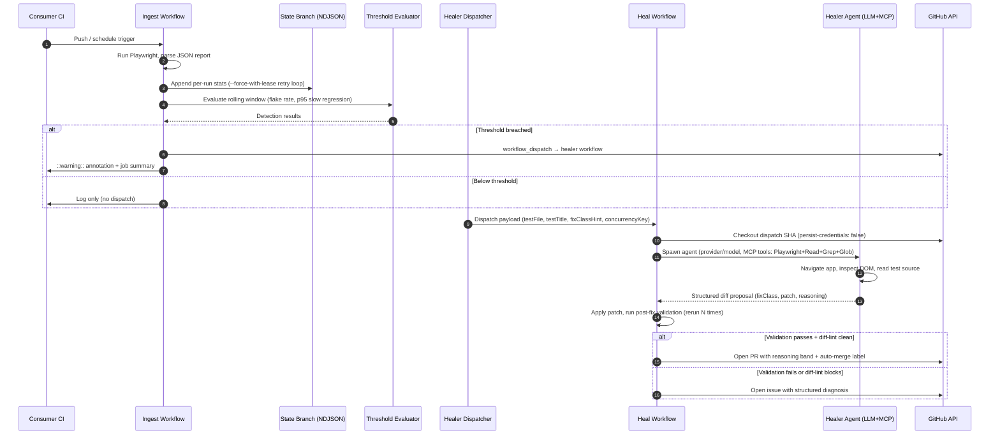

# playwright-healer

A reusable GitHub Action that watches Playwright test health across CI runs and auto-heals
flaky, failing, or slow tests. When a test crosses configurable thresholds, a companion
workflow uses an LLM agent driving the Playwright MCP to reproduce the failure, diagnose the
root cause, propose a fix, validate it, and open a PR. When it cannot propose a fix, it files
a structured GitHub issue with root-cause analysis and debugging hints.

**Value proposition:** A flaky Playwright test should result in a reviewable PR (or a
structured issue) without a human reading logs.

> **What it does NOT do:** playwright-healer heals *test code* only — selector drift, timing
> issues, assertion brittleness, and slow-test patterns. It does not fix bugs in your
> application code.

---

## Quick start

Adopt playwright-healer in one PR by following these four steps.

### Step 1 — Copy the healer workflow

Copy [`docs/examples/gemini.yml`](docs/examples/gemini.yml) (Gemini 2.5 Flash, free tier,
recommended) or [`docs/examples/github-models.yml`](docs/examples/github-models.yml) (GitHub
Models gpt-4.1, single-PAT setup) into your repo as `.github/workflows/playwright-healer.yml`.

### Step 2 — Add the ingest snippet to your existing CI

Copy the snippet from [`docs/examples/ingest.yml`](docs/examples/ingest.yml) and add it as a
final step in the CI workflow that already runs your Playwright tests. The snippet runs after
your `upload-artifact` step and appends per-run stats to a dedicated state branch.

```yaml
# In your existing CI workflow, after the upload-artifact step:
- name: playwright-healer ingest
  uses: Sacharified/playwright-healer@v1
  with:
    mode: ingest
    report_path: test-results/results.json   # path to your Playwright JSON report
    healer_token: ${{ secrets.HEALER_PAT }}
    github_token: ${{ github.token }}
```

### Step 3 — Add secrets

| Secret | Used for |
|--------|---------|
| `GEMINI_API_KEY` | Gemini provider (Google AI Studio — free tier) |
| `HEALER_PAT` | PAT for PR creation and workflow dispatch (see [Token scopes](#token-scopes--why-githubtoken-doesnt-work)) |

For GitHub Models: only `HEALER_PAT` is needed — it covers both `api_key` and `healer_token`.

### Step 4 — Push

The ingest workflow begins collecting per-run stats immediately. When a test crosses a
configurable threshold (default: 20% flake rate over 7 days), the healer workflow is
dispatched automatically.

---

## Architecture

playwright-healer uses a two-workflow hybrid. An ingest step runs at the end of your existing
CI and appends rolling stats to a dedicated `playwright-healer-state` branch (NDJSON,
append-only, `--force-with-lease` retry loop). When thresholds are breached, a separate healer
workflow is dispatched via `workflow_dispatch` — non-blocking, runs as a separate job on its
own runner.



---

## Prerequisites

> **These must be in place before playwright-healer can ingest your test results.**

1. **Playwright trace must be enabled.** In your `playwright.config.ts`, set
   `trace: 'on'` or `trace: 'retain-on-failure'`. Without trace data, the agent loop
   cannot reproduce failures reliably.

2. **Your CI must upload the Playwright JSON report as an artifact.** Add an
   `upload-artifact` step that uploads the JSON report before the ingest step:

   ```yaml
   - name: Upload Playwright report
     if: always()
     uses: actions/upload-artifact@v4
     with:
       name: playwright-report
       path: test-results/
   ```

3. **`actions: write` permission OR a `HEALER_PAT`.** The ingest step needs permission to
   trigger the healer workflow via `workflow_dispatch`. `GITHUB_TOKEN` can do this for
   simple setups, but PRs opened by `GITHUB_TOKEN` do not trigger downstream CI — see
   [Token scopes](#token-scopes--why-githubtoken-doesnt-work).

4. **Node 20+ on your CI runner.** The action installs its own Node 24 environment via
   `actions/setup-node`, but your runner must already have Node 20+ available to bootstrap
   the composite action steps.

---

## Token scopes & why GITHUB_TOKEN doesn't work

### The recursion guard

GitHub prevents `GITHUB_TOKEN` from triggering downstream CI on PRs opened by that token.
This is GitHub's deliberate recursion guard — it stops automated workflows from creating
infinite CI loops.

For playwright-healer this matters in two places:

1. **PR validation:** When the healer opens a PR with `GITHUB_TOKEN`, the PR's required
   status checks never get triggered. The healer validates the fix locally before opening
   the PR, so the PR is safe to merge — but your branch protection rules won't see green CI
   automatically.

2. **Workflow dispatch:** `GITHUB_TOKEN` can dispatch `workflow_dispatch` events, but the
   dispatched workflow's token will also be `GITHUB_TOKEN` — which means the healer workflow
   itself cannot open PRs that trigger CI. The token scopes compound.

**Solution:** Provide a `HEALER_PAT` — a fine-grained Personal Access Token or a classic PAT
with the following scopes.

### Required PAT scopes

**Fine-grained PAT (recommended):**

| Permission | Scope | Why |
|-----------|-------|-----|
| Contents | Write | Push the fix branch, open PR |
| Pull requests | Write | Create and update PRs |
| Issues | Write | Open fallback diagnosis issues |
| Actions | Read | Trigger workflow dispatch |

**Classic PAT:** `repo` scope (covers all of the above for a single repo).

**GitHub Models users:** The same `HEALER_PAT` covers both `api_key` (for LLM inference via
`models:read` scope) and `healer_token` (for PR/dispatch). Add `models:read` to your PAT and
use the same secret for both inputs.

### `healer_token` vs `api_key`

| Input | Purpose | Default |
|-------|---------|---------|
| `healer_token` | PR creation, workflow dispatch, issue creation | Required |
| `api_key` | LLM provider inference (Gemini, Anthropic, GitHub Models) | Required (except Ollama) |
| `github_token` | Low-scope state-branch operations | `${{ github.token }}` (built-in) |

For Gemini: `api_key` = your `GEMINI_API_KEY`, `healer_token` = your `HEALER_PAT`.
For GitHub Models: both `api_key` and `healer_token` can be the same `HEALER_PAT`.

---

## Example workflows

Three ready-to-use example files live under [`docs/examples/`](docs/examples/):

### `docs/examples/gemini.yml` — Gemini 2.5 Flash (recommended)

Gemini 2.5 Flash is the default recommendation for v0.1.0:
- 1M token context window — handles large test suites
- Free tier on Google AI Studio
- Proven in end-to-end heal demos (~$0.03–$0.05/run)

Requires: `GEMINI_API_KEY` (Google AI Studio) + `HEALER_PAT`.

### `docs/examples/github-models.yml` — GitHub Models gpt-4.1

GitHub Models gpt-4.1 is the recommended alternative:
- Single `HEALER_PAT` covers both `api_key` and `healer_token` (add `models:read` scope)
- Free tier, no separate API account needed
- 128K token context window

### `docs/examples/ingest.yml` — Ingest snippet

Paste this snippet into your existing CI workflow after your `upload-artifact` step. Works
with both Gemini and GitHub Models heal workflows.

---

## Switching providers

Gemini and GitHub Models are **fully supported** in v0.1.0. Anthropic and Ollama adapters are
in preview and not yet functional in v0.1.0 — use Gemini or GitHub Models for production use.

| Provider | Status | `provider` | `model` | `api_key` |
|----------|--------|------------|---------|-----------|
| Gemini 2.5 Flash | **Supported** | `gemini` | `gemini-2.5-flash` | `${{ secrets.GEMINI_API_KEY }}` |
| GitHub Models gpt-4.1 | **Supported** | `github` | `openai/gpt-4.1` | `${{ secrets.HEALER_PAT }}` |
| Anthropic claude-sonnet-4-6 | Preview | `anthropic` | `claude-sonnet-4-6` | `${{ secrets.ANTHROPIC_API_KEY }}` |
| Ollama (local) | Preview | `ollama` | `llama3.1` | _(not required)_ |

Change the three `provider`, `model`, and `api_key` inputs in your healer workflow to switch:

```yaml
- uses: Sacharified/playwright-healer@v1
  with:
    mode: heal
    provider: gemini                              # change this
    model: gemini-2.5-flash                       # change this
    api_key: ${{ secrets.GEMINI_API_KEY }}        # change this
    healer_token: ${{ secrets.HEALER_PAT }}       # stays the same
    # ... other inputs
```

---

## Auto-merge prerequisites

To enable auto-merge for high-confidence healer PRs, set `enable_auto_merge: true` in your
healer workflow. Auto-merge is opt-in and off by default.

For the full prerequisites matrix, see [docs/auto-merge.md](docs/auto-merge.md).

---

## Troubleshooting

**Heal step runs out of memory (OOM).**

The agent loop can be memory-intensive on large test suites. Increase the runner's available
memory via `runs-on: ubuntu-latest-16-core` (larger runner), or reduce `max_turns` (default
30) to limit how many agent iterations run.

---

**Agent fix rejected by diff-lint.**

The healer runs a diff-lint pass after applying the fix. The lint blocks `waitForTimeout`
calls, positional selectors (`:nth-child`, `:eq()`), and weakened assertions. The job summary
shows the exact pattern that was blocked. Review the blocked pattern — if it's legitimately
needed, open a manual fix instead.

---

**Validation failures: fix does not reach the required pass rate.**

The fix must pass the test N times (`rerun_count`, default 10) at the configured pass rate
(`rerun_pass_rate`, default 90%). If the fix is inherently flaky, the healer falls back to
opening a diagnosis issue. Lower `rerun_count` cautiously — reducing it increases the risk of
accepting a flaky fix.

---

**PR not opening / `GITHUB_TOKEN` doesn't work.**

PRs opened by `GITHUB_TOKEN` do not trigger downstream CI due to GitHub's recursion guard.
Provide a `HEALER_PAT` with the required scopes — see
[Token scopes](#token-scopes--why-githubtoken-doesnt-work). Verify the PAT has not expired.

---

**Auto-merge soft-fail: PR opened but auto-merge not set.**

The healer emits a `::warning::` in the job summary describing which prerequisite is missing.
Common causes: repository does not have "Allow auto-merge" enabled, or branch protection does
not require status checks. See [docs/auto-merge.md](docs/auto-merge.md) for the full
soft-fail behavior matrix.

---

**Mermaid diagram shows as raw text instead of rendering.**

GitHub renders Mermaid diagrams natively in markdown. If the diagram appears as raw text,
you may be on a GitHub Enterprise instance that lags behind github.com's Mermaid version.
Check your GHE release notes for Mermaid support, or view this README directly on
github.com/Sacharified/playwright-healer.

---

## Roadmap

**v0.1.x** — live auto-merge happy-path demonstration once the public repo has branch
protection enabled (deferred from v0.1.0 due to fixture constraints). More provider support
as Anthropic and Ollama adapters mature from preview to production.

**v0.2** — trace-aware confidence bands using Playwright trace file analysis for higher-fidelity
root-cause classification. App-code fix capability is under consideration but remains out of
scope until the test-code fix classes are fully battle-tested.

---

## Contributing & Security

See [CONTRIBUTING.md](CONTRIBUTING.md) for contribution guidelines.
See [SECURITY.md](SECURITY.md) for vulnerability reporting.
