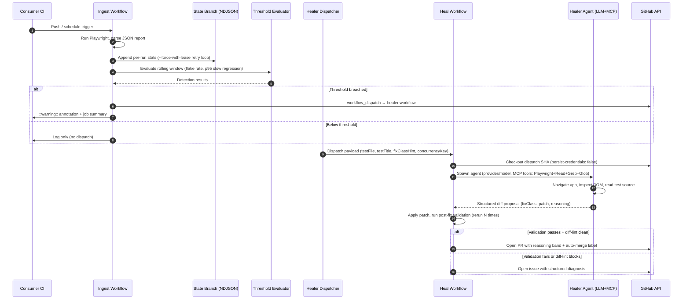

# playwright-healer

A reusable GitHub Action that watches Playwright test health across CI runs and auto-heals
flaky, failing, or slow tests. When a test crosses configurable thresholds, a companion
workflow uses an LLM agent driving the Playwright MCP to reproduce the failure, diagnose the
root cause, propose a fix, validate it, and open a PR. When it cannot propose a fix, it files
a structured GitHub issue with root-cause analysis and debugging hints.

**Value proposition:** A flaky Playwright test should result in a reviewable PR (or a
structured issue) without a human reading logs.

> **What it does NOT do:** playwright-healer heals *test code* only — selector drift, timing
> issues, assertion brittleness, and slow-test patterns. It does not fix bugs in your
> application code.

---

## Quick start

Adopt playwright-healer in one PR by following these four steps.

### Step 1 — Copy the healer workflow

Copy [`docs/examples/openrouter.yml`](docs/examples/openrouter.yml) (OpenRouter — recommended;
one OpenAI-compatible endpoint fronts Anthropic, Google, OpenAI, Meta, and ~30 other model
providers) or [`docs/examples/github-models.yml`](docs/examples/github-models.yml) (GitHub
Models gpt-4.1 free tier, single-PAT setup) into your repo as
`.github/workflows/playwright-healer.yml`.

### Step 2 — Add the ingest snippet to your existing CI

Copy the snippet from [`docs/examples/ingest.yml`](docs/examples/ingest.yml) and add it as a
final step in the CI workflow that already runs your Playwright tests. The snippet runs after
your `upload-artifact` step and appends per-run stats to a dedicated state branch.

```yaml
# In your existing CI workflow, after the upload-artifact step:
- name: playwright-healer ingest
  uses: Sacharified/playwright-healer@v1
  with:
    mode: ingest
    report_path: test-results/results.json   # path to your Playwright JSON report
    healer_token: ${{ secrets.HEALER_PAT }}
    github_token: ${{ github.token }}
```

### Step 3 — Add secrets

| Secret | Used for |
|--------|---------|
| `OPENROUTER_API_KEY` | OpenRouter API key — covers Anthropic, Google, OpenAI, Meta, and other upstream providers via one endpoint |
| `HEALER_PAT` | PAT for PR creation and workflow dispatch (see [Token scopes](#token-scopes--why-githubtoken-doesnt-work)) |

For GitHub Models: only `HEALER_PAT` is needed — it covers both `api_key` and `healer_token`.

### Step 4 — Push

The ingest workflow begins collecting per-run stats immediately. When a test crosses a
configurable threshold (default: 20% flake rate over 7 days), the healer workflow is
dispatched automatically.

---

## Integrate with an LLM coding agent

Prefer to hand the integration to your coding agent (Claude Code, Cursor, Codex, Aider, etc.)?
Copy the prompt below into the agent — it points the agent at this repo's example files as the
source of truth, lists what to discover from the consumer repo, and pins the security
non-negotiables that must not be relaxed.

````
I want to integrate the playwright-healer GitHub Action into this repo's Playwright CI.
It auto-heals flaky/failing tests by opening reviewable PRs.

Repo: https://github.com/Sacharified/playwright-healer

1. Read these files for the canonical setup — do not improvise from memory:
   - docs/examples/openrouter.yml  (heal workflow — recommended provider)
   - docs/examples/ingest.yml      (ingest snippet appended to existing CI)
   - README.md sections "Prerequisites" and "Token scopes & why GITHUB_TOKEN doesn't work"

2. Discover from THIS repo:
   - The CI workflow that runs Playwright (search .github/workflows/).
   - playwright.config.{ts,js}: confirm `trace: 'on'` or `trace: 'retain-on-failure'`. If
     neither is set, add `retain-on-failure` and call it out for me to confirm.
   - The JSON report path. Either set `reporter: [['json', { outputFile: '...' }]]` in
     the Playwright config, or pass `--reporter=json` with a known output path. Pick a
     stable file path (e.g. test-results/results.json) — playwright-healer's `report_path`
     defaults to that.
   - How the app is built and started locally (look in package.json scripts and the
     repo README). I need values for `setup_command`, `start_command`, and `base_url`
     to put in the heal workflow.

3. Make these changes:
   a. Create .github/workflows/playwright-healer.yml from openrouter.yml. Replace the four
      placeholders (base_url, setup_command, start_command, test_command) with the values
      you discovered. Keep `persist-credentials: false` and the pinned `actions/checkout`
      SHA exactly as shown.
   b. Edit the existing Playwright CI workflow:
      - Make sure the test step writes a JSON report at the path chosen above.
      - Add `actions/upload-artifact` (if not already present) for the report directory.
      - Append the ingest step from ingest.yml as the final step in the same job. Set
        `report_path` to the JSON file path. Keep `if: always()` so flake stats are
        captured on test failure too.

4. Tell me to do these myself — DO NOT do them for me:
   - Create a Personal Access Token with the scopes listed under README → "Token scopes"
     and add it as repo secret `HEALER_PAT`.
   - Create an OpenRouter API key at https://openrouter.ai/keys and add it as repo secret
     `OPENROUTER_API_KEY`. (Or, if you are using GitHub Models free tier, follow
     docs/examples/github-models.yml instead and reuse `HEALER_PAT` for both inputs.)
   - Auto-dispatch is OFF by default. After secrets land, either set
     `enable_auto_dispatch: 'true'` in the ingest step, or leave it off and trigger the
     heal workflow manually from the Actions tab for the first few runs.

5. Hard constraints — do not change any of these from the example files:
   - `persist-credentials: false` on every checkout step.
   - Never use `pull_request_target` — playwright-healer hard-fails on that trigger.
   - Reference the action as `Sacharified/playwright-healer@v1`. Do not vendor, fork,
     or bundle it.
   - Do not add `Bash`, `Write`, or `Edit` to any agent tool allowlist.

6. Verify before reporting done:
   - The ingest step's `report_path` matches what Playwright actually writes.
   - The heal workflow's `start_command` boots the app on the port in `base_url`.
   - Both workflow files pass `actionlint` if it is available locally.
   - Open the new heal workflow's YAML and confirm it still has `persist-credentials: false`.

Default to Gemini unless I tell you otherwise. If anything is ambiguous, ask before
making changes.
````

---

## Architecture

playwright-healer uses a two-workflow hybrid. An ingest step runs at the end of your existing
CI and appends rolling stats to a dedicated `playwright-healer-state` branch (NDJSON,
append-only, `--force-with-lease` retry loop). When thresholds are breached, a separate healer
workflow is dispatched via `workflow_dispatch` — non-blocking, runs as a separate job on its
own runner.



---

## Prerequisites

> **These must be in place before playwright-healer can ingest your test results.**

1. **Playwright trace must be enabled.** In your `playwright.config.ts`, set
   `trace: 'on'` or `trace: 'retain-on-failure'`. Without trace data, the agent loop
   cannot reproduce failures reliably.

2. **Your CI must upload the Playwright JSON report as an artifact.** Add an
   `upload-artifact` step that uploads the JSON report before the ingest step:

   ```yaml
   - name: Upload Playwright report
     if: always()
     uses: actions/upload-artifact@v4
     with:
       name: playwright-report
       path: test-results/
   ```

3. **`actions: write` permission OR a `HEALER_PAT`.** The ingest step needs permission to
   trigger the healer workflow via `workflow_dispatch`. `GITHUB_TOKEN` can do this for
   simple setups, but PRs opened by `GITHUB_TOKEN` do not trigger downstream CI — see
   [Token scopes](#token-scopes--why-githubtoken-doesnt-work).

4. **Node 20+ on your CI runner.** The action installs its own Node 24 environment via
   `actions/setup-node`, but your runner must already have Node 20+ available to bootstrap
   the composite action steps.

---

## Token scopes & why GITHUB_TOKEN doesn't work

### The recursion guard

GitHub prevents `GITHUB_TOKEN` from triggering downstream CI on PRs opened by that token.
This is GitHub's deliberate recursion guard — it stops automated workflows from creating
infinite CI loops.

For playwright-healer this matters in two places:

1. **PR validation:** When the healer opens a PR with `GITHUB_TOKEN`, the PR's required
   status checks never get triggered. The healer validates the fix locally before opening
   the PR, so the PR is safe to merge — but your branch protection rules won't see green CI
   automatically.

2. **Workflow dispatch:** `GITHUB_TOKEN` can dispatch `workflow_dispatch` events, but the
   dispatched workflow's token will also be `GITHUB_TOKEN` — which means the healer workflow
   itself cannot open PRs that trigger CI. The token scopes compound.

**Solution:** Provide a `HEALER_PAT` — a fine-grained Personal Access Token or a classic PAT
with the following scopes.

### Required PAT scopes

**Fine-grained PAT (recommended):**

| Permission | Scope | Why |
|-----------|-------|-----|
| Contents | Write | Push the fix branch, open PR |
| Pull requests | Write | Create and update PRs |
| Issues | Write | Open fallback diagnosis issues |
| Actions | Write | Trigger workflow dispatch |

**Classic PAT:** `repo` scope (covers all of the above for a single repo).

**GitHub Models users:** The same `HEALER_PAT` covers both `api_key` (for LLM inference via
`models:read` scope) and `healer_token` (for PR/dispatch). Add `models:read` to your PAT and
use the same secret for both inputs.

### `healer_token` vs `api_key`

| Input | Purpose | Default |
|-------|---------|---------|
| `healer_token` | PR creation, workflow dispatch, issue creation | Required |
| `api_key` | LLM provider inference (OpenRouter, GitHub Models, or omitted for Ollama) | Required (except Ollama) |
| `github_token` | Low-scope state-branch operations | `${{ github.token }}` (built-in) |

For OpenRouter: `api_key` = your `OPENROUTER_API_KEY`, `healer_token` = your `HEALER_PAT`.
For GitHub Models: both `api_key` and `healer_token` can be the same `HEALER_PAT`.

> **Trust chain note:** When `provider: openrouter`, the OpenRouter API key has access to
> whatever upstream models the user enables in their OpenRouter account. OpenRouter sits
> between the GitHub Actions runner and the upstream model provider — treat the OpenRouter
> key with the same care as a direct provider key.

---

## Example workflows

Three ready-to-use example files live under [`docs/examples/`](docs/examples/):

### `docs/examples/openrouter.yml` — OpenRouter (recommended)

OpenRouter is the default recommendation:
- One OpenAI-compatible endpoint fronts Anthropic, Google, OpenAI, Meta, and ~30 other
  model providers — swap the `model` slug to switch upstream without other config changes.
- Default model `anthropic/claude-sonnet-4.6` (note OpenRouter's slug uses a dot, distinct
  from Anthropic SDK's hyphenated `claude-sonnet-4-6`).
- Per-call USD comes back in `usage.cost`; both `max_turns` and `max_budget_usd` are
  enforced as pre-call gates.

Requires: `OPENROUTER_API_KEY` (https://openrouter.ai/keys) + `HEALER_PAT`.

### `docs/examples/github-models.yml` — GitHub Models gpt-4.1

GitHub Models gpt-4.1 is the recommended alternative:
- Single `HEALER_PAT` covers both `api_key` and `healer_token` (add `models:read` scope)
- Free tier, no separate API account needed
- 128K token context window

### `docs/examples/ingest.yml` — Ingest snippet

Paste this snippet into your existing CI workflow after your `upload-artifact` step. Works
with both OpenRouter and GitHub Models heal workflows.

---

## Switching providers

OpenRouter and GitHub Models are **fully supported**. The Ollama adapter is a stub —
self-hosted localhost support lands in a future phase.

| Provider | Status | `provider` | `model` (examples) | `api_key` |
|----------|--------|------------|--------------------|-----------|
| OpenRouter (Claude Sonnet 4.6) | **Supported** | `openrouter` | `anthropic/claude-sonnet-4.6` | `${{ secrets.OPENROUTER_API_KEY }}` |
| OpenRouter (Gemini 2.5 Flash)  | **Supported** | `openrouter` | `google/gemini-2.5-flash` | `${{ secrets.OPENROUTER_API_KEY }}` |
| OpenRouter (gpt-4.1)           | **Supported** | `openrouter` | `openai/gpt-4.1` | `${{ secrets.OPENROUTER_API_KEY }}` |
| OpenRouter (Llama 3.1 70B)     | **Supported** | `openrouter` | `meta-llama/llama-3.1-70b-instruct` | `${{ secrets.OPENROUTER_API_KEY }}` |
| GitHub Models gpt-4.1 (free)   | **Supported** | `github`     | `openai/gpt-4.1` | `${{ secrets.HEALER_PAT }}` |
| Ollama (local)                 | Stub          | `ollama`     | `llama3.1` | _(not required)_ |

To switch upstream within OpenRouter, change just the `model` line in your healer workflow:

```yaml
- uses: Sacharified/playwright-healer@v1
  with:
    mode: heal
    provider: openrouter                          # stays the same
    model: google/gemini-2.5-flash                # change this to swap upstream
    api_key: ${{ secrets.OPENROUTER_API_KEY }}    # stays the same
    healer_token: ${{ secrets.HEALER_PAT }}       # stays the same
    # ... other inputs
```

Browse the full OpenRouter model catalog at https://openrouter.ai/models.

---

## Auto-merge prerequisites

To enable auto-merge for high-confidence healer PRs, set `enable_auto_merge: true` in your
healer workflow. Auto-merge is opt-in and off by default.

For the full prerequisites matrix, see [docs/auto-merge.md](docs/auto-merge.md).

---

## Troubleshooting

**Heal step runs out of memory (OOM).**

The agent loop can be memory-intensive on large test suites. Increase the runner's available
memory via `runs-on: ubuntu-latest-16-core` (larger runner), or reduce `max_turns` (default
30) to limit how many agent iterations run.

---

**Agent fix rejected by diff-lint.**

The healer runs a diff-lint pass after applying the fix. The lint blocks `waitForTimeout`
calls, positional selectors (`:nth-child`, `:eq()`), and weakened assertions. The job summary
shows the exact pattern that was blocked. Review the blocked pattern — if it's legitimately
needed, open a manual fix instead.

---

**Validation failures: fix does not reach the required pass rate.**

The fix must pass the test N times (`rerun_count`, default 10) at the configured pass rate
(`rerun_pass_rate`, default 90%). If the fix is inherently flaky, the healer falls back to
opening a diagnosis issue. Lower `rerun_count` cautiously — reducing it increases the risk of
accepting a flaky fix.

---

**PR not opening / `GITHUB_TOKEN` doesn't work.**

PRs opened by `GITHUB_TOKEN` do not trigger downstream CI due to GitHub's recursion guard.
Provide a `HEALER_PAT` with the required scopes — see
[Token scopes](#token-scopes--why-githubtoken-doesnt-work). Verify the PAT has not expired.

---

**Auto-merge soft-fail: PR opened but auto-merge not set.**

The healer emits a `::warning::` in the job summary describing which prerequisite is missing.
Common causes: repository does not have "Allow auto-merge" enabled, or branch protection does
not require status checks. See [docs/auto-merge.md](docs/auto-merge.md) for the full
soft-fail behavior matrix.

---

**Mermaid diagram shows as raw text instead of rendering.**

GitHub renders Mermaid diagrams natively in markdown. If the diagram appears as raw text,
you may be on a GitHub Enterprise instance that lags behind github.com's Mermaid version.
Check your GHE release notes for Mermaid support, or view this README directly on
github.com/Sacharified/playwright-healer.

---

## Roadmap

**v0.1.x** — live auto-merge happy-path demonstration once the public repo has branch
protection enabled (deferred from v0.1.0 due to fixture constraints). More provider support
as Anthropic and Ollama adapters mature from preview to production.

**v0.2** — trace-aware confidence bands using Playwright trace file analysis for higher-fidelity
root-cause classification. App-code fix capability is under consideration but remains out of
scope until the test-code fix classes are fully battle-tested.

---

## Contributing & Security

See [CONTRIBUTING.md](CONTRIBUTING.md) for contribution guidelines.
See [SECURITY.md](SECURITY.md) for vulnerability reporting.
